```{r setup, include=FALSE}
library(knitr)
library(fontawesome)
library(locktonr)
options(htmltools.dir.version = FALSE)
opts_chunk$set(
  echo = FALSE, warning = FALSE, message = FALSE, comment = "#>",
  fig.path = 'figure/', fig.align = 'center', fig.height = 3.0,
  out.width = '100%', fig.show = 'hold', fig.retina = 3,
  cache = TRUE, cache.path = 'cache/'
)
```

```{r xaringan-themer, include=FALSE, warning=FALSE}
library(xaringanthemer)
style_mono_accent(
  base_color = "#00AEEF",
  black_color = "#000000",
  header_color = "#000000",
  text_slide_number_color = "#000000",
  padding = "8px 64px 8px 64px",
  inverse_background_color = "#000000",
  title_slide_background_color = "#000000",
  title_slide_background_image = "img/lockton-title-background.png",
  left_column_subtle_color = "#00AEEF",
  blockquote_left_border_color = "#00AEEF",
  footnote_color = "#A1ABB2",
  link_color = "#EF5399",
  header_background_auto = FALSE,
  header_background_content_padding_top = "5rem",
  header_font_google = google_font("EB Garamond"),
  text_font_google   = google_font("Sarabun"),
  code_font_google   = google_font("Fira Mono"),
  outfile = "xaringan-lockton.css"
  # background_image = "img/light-blue-line.png",
  # background_size = "4%",
  # background_position = "5% 18%"
)
```


layout: true
background-image: url(img/lockton-divider-background.PNG)
---
class: inverse, left, middle

# Why communicate uncertainty?

---
layout: false
class: center, middle

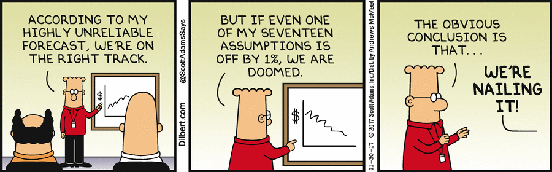

---
layout: true
background-image: url(img/light-blue-line.png)
background-position: 5% 18%
background-size: 4%
---
class: left, top

# Insurance (and life!) is an uncertain business

NY Times article: [`r fa(name = "link")` Those Hurricane Maps Don't Mean What You Think They Mean](https://www.nytimes.com/interactive/2019/08/29/opinion/hurricane-dorian-forecast-map.html)

--

.pull-left[

#### .base[Irma Track - Thursday]

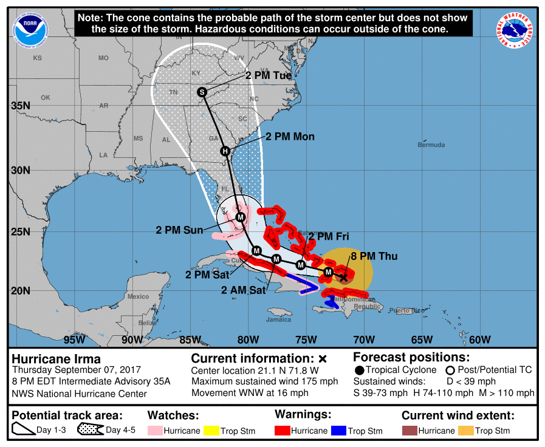

]

--

.pull-right[

#### .base[Irma Track - Actual]

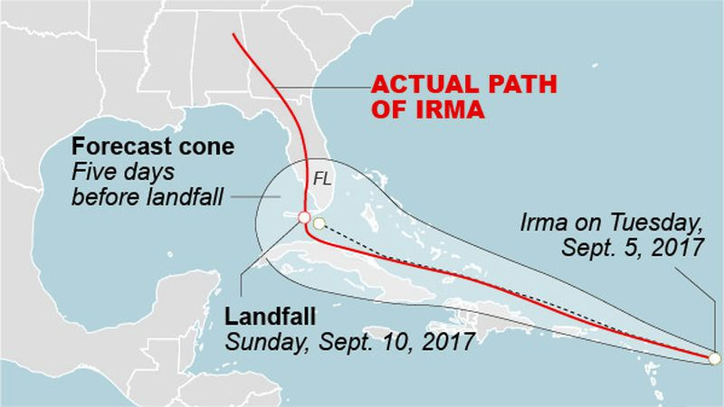

]

---

# Actuarial work is an uncertain business

.center[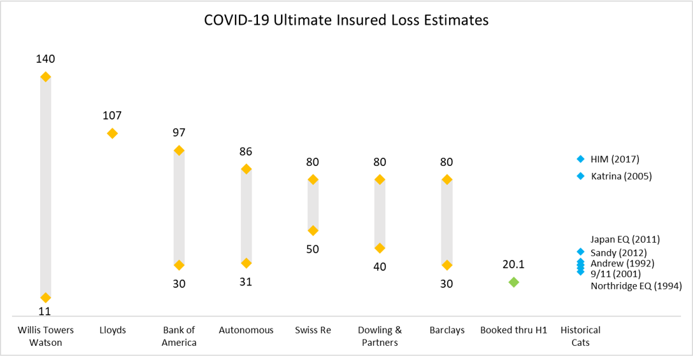]

---

# Our standards compel us


--

.pull-left[

#### .base[ASOP 41 - Actuarial Communication]


]

--

.pull-right[

#### .base[ASOP 43 - Unpaid Claim Estimates]


]

---
layout: true
background-image: url(img/lockton-divider-background.PNG)
---
class: inverse, left, middle

# What can we learn from the academic research?

---
layout: true
background-image: url(img/light-blue-line.png)
background-position: 5% 18%
background-size: 4%
---
class: left, top

# MU Collective 

[`r fa(name = "link")` https://mucollective.northwestern.edu/](https://mucollective.northwestern.edu/)


---

# Research: Hypothetical Outcome Plots (HOPs)

[`r fa(name = "link")` Hypothetical Outcome Plots Outperform Error Bars and Violin Plots for Inferences about Reliability of Variable Ordering](https://mucollective.northwestern.edu/project/hops)  
[`r fa(name = "link")` Hypothetical Outcome Plots Help Untrained Observers Judge Trends in Ambiguous Data](https://mucollective.northwestern.edu/project/hops-trends)
--
.pull-left[
#### .base[Static error bars]

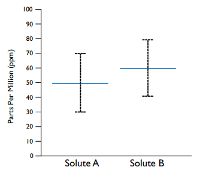
]
--
.pull-right[

#### .base[HOP]

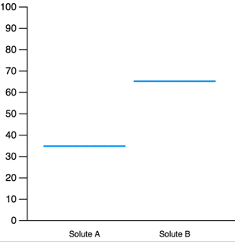
]
---

# Research: Frequency based plots

[`r fa(name = "link")` Uncertainty Displays Using Quantile Dotplots or CDFs Improve Transit Decision-Making](https://mucollective.northwestern.edu/project/uncertainty-bus)

--

.pull-left[

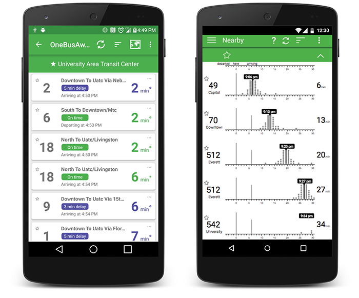
]
--
.pull-right[

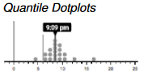

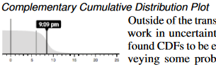

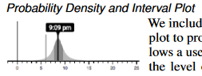

]

---
layout: true
background-image: url(img/lockton-divider-background.PNG)
---
class: inverse, left, middle

# How to apply?

---
layout: true
background-image: url(img/trump-biden.jpg)
background-size: contain
---
class: inverse, right, middle

---
layout: true
background-image: url(img/light-blue-line.png)
background-position: 5% 18%
background-size: 4%
---
class: left, top

# Forecasting the Presidential Election

[`r fa(name = "link")` Information, incentives, and goals in election forecasts](http://www.stat.columbia.edu/~gelman/research/published/jdm200907b.pdf)  
--
.pull-left[
### 
[`r fa(name = "link")` https://projects.economist.com/us-2020-forecast/president](https://projects.economist.com/us-2020-forecast/president)  

]
--
.pull-right[
### 
[`r fa(name = "link")` https://projects.fivethirtyeight.com/2020-election-forecast/](https://projects.fivethirtyeight.com/2020-election-forecast/)  
.center[]

]

---
layout: false
class: left, middle

.pull-left[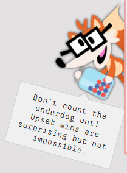]

--
.pull-right[]


---
layout: true
background-image: url(img/light-blue-line.png)
background-position: 5% 18%
background-size: 4%
---
class: left, top

# Loss reserving example - model fit

.center[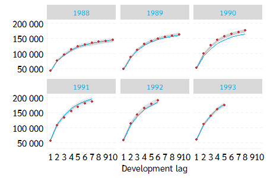]

---

# Loss reserving example - quantile dotplot

```{r read-sims, echo=FALSE}
cl_sims <- readRDS("R/cl_sims_byay.rds")
locktonr::gg_set_lockton_theme(base_family = "Sarabun")
```
```{r cl-plot2, echo=FALSE, fig.height=3.2}
gg_quantdot_ay <- cl_sims %>% 
  group_by(.draw) %>% 
  summarise(.prediction = sum(.prediction)) %>% 
  ungroup() %>% 
  ggplot(aes(x = .prediction)) +
  ggdist::stat_dots(quantiles = 100) +
  scale_x_continuous(labels = number_format) +
  scale_y_continuous(labels = NULL, breaks = NULL) +
  labs(x = NULL, y = NULL, title = "Distribution of total reserve estimate")
gg_quantdot_ay
```

---

# Loss reserving example - CCDF plot

```{r cl-plot3, echo=FALSE}
gg_ccdf_ay <- cl_sims %>% 
  group_by(acc_yr, .draw) %>% 
  summarise(.prediction = sum(.prediction)) %>% 
  ungroup() %>% 
  mutate(acc_yr2 = as.integer(acc_yr),
         acc_yr = forcats::fct_reorder(acc_yr, acc_yr2, .desc = TRUE)) %>% 
  filter(acc_yr2 >= 5) %>% 
  ggplot(aes(x = .prediction, y = acc_yr)) +
  ggdist::stat_ccdfinterval() +
  scale_x_continuous(labels = number_format) +
  labs(x = NULL, y = NULL, title = "Distribution of reserve estimates by accident year")
gg_ccdf_ay
```

---

# Cat loss simulation example

.center[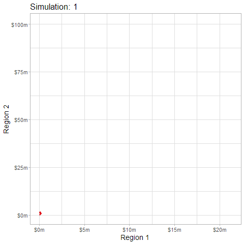]

---
class: inverse, left, top

# Conclusion

### We should be thinking about how to best communicate uncertainty
### We can learn from academic literature (e.g. HOPs, quantile dotplots, etc.)
### We can use modern tools to make this easier (e.g. web, R/Python, etc.)

---
layout: true
background-image: url(img/lockton-title-background.png)
background-size: cover
---
class: right, middle, inverse

### atroyer@lockton.com
### Slides: [`r fa(name = "link", fill = "white")` maf-uncertainty-viz.netlify.app/](https://maf-uncertainty-viz.netlify.app/)
### Code: [`r fa(name = "github", fill = "white")` ](https://github.com/problemofpoints/viz-uncertainty-presentation)


